# 🚀 BilFit: Campus Sports Management System

**BilFit** is an end-to-end platform designed to digitize the management of on-campus sports facilities, enable student matchmaking, and streamline tournament organizations. Whether you want to reserve a court for a solo session or find a suitable opponent through the **Duello** system, BilFit elevates the campus sports culture.

## ✨ Key Features

* **Smart Reservation System:** Track real-time facility occupancy and book your spot for preferred time slots.
* **Duello & ELO Matching:** Find opponents matching your skill level. Earn dynamic ELO points based on match results and climb the leaderboard.
* **Tournament Management:** Form your team, apply for tournaments, and follow automatically generated fixtures.
* **Advanced Profile & Social Network:** Add friends, track your Reliability Score, and customize your profile based on sports interests.
* **Comprehensive Admin Panel:** Manage facility maintenance, apply no-show penalties, manage tournament fixtures, and monitor system statistics.

---

## 📸 In-App Gallery

Explore the modern and user-friendly interface of BilFit:

### User Interface
* **Login Panel:** Dedicated secure login and registration portal for students.
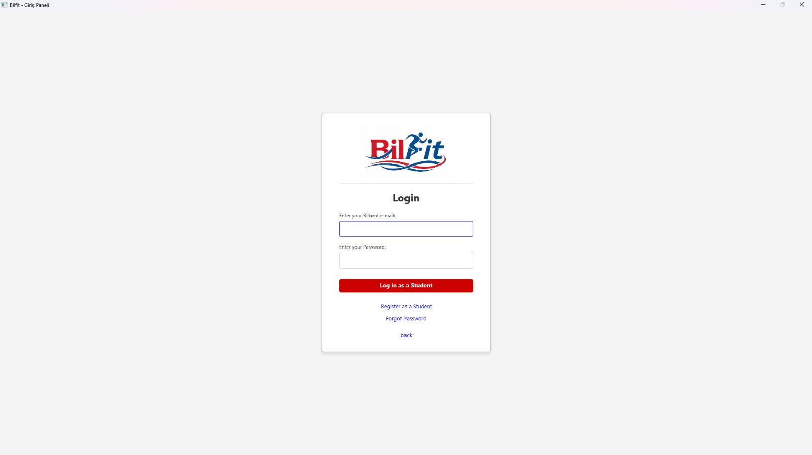
* **Friends Network:** Social tab for managing current friends, as well as incoming and outgoing requests.
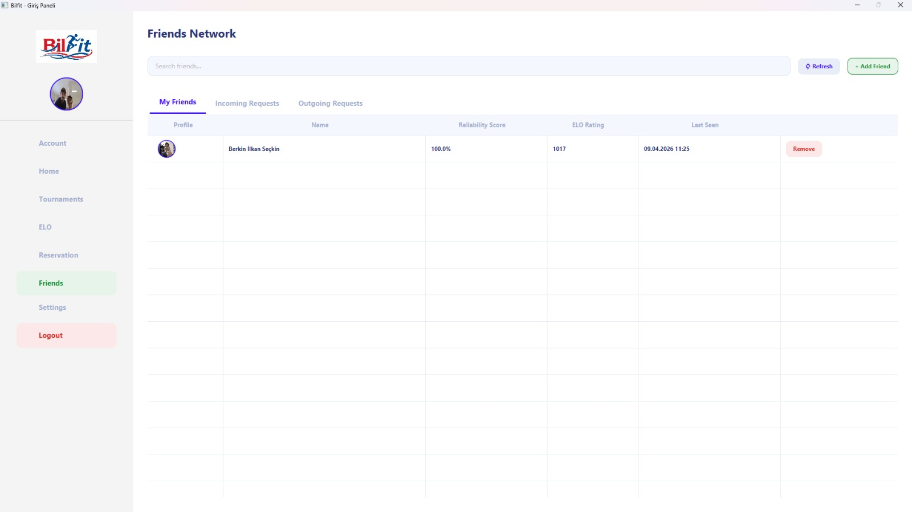
* **User Settings:** Area for updating passwords, changing nicknames, and toggling ELO/Public profile preferences.
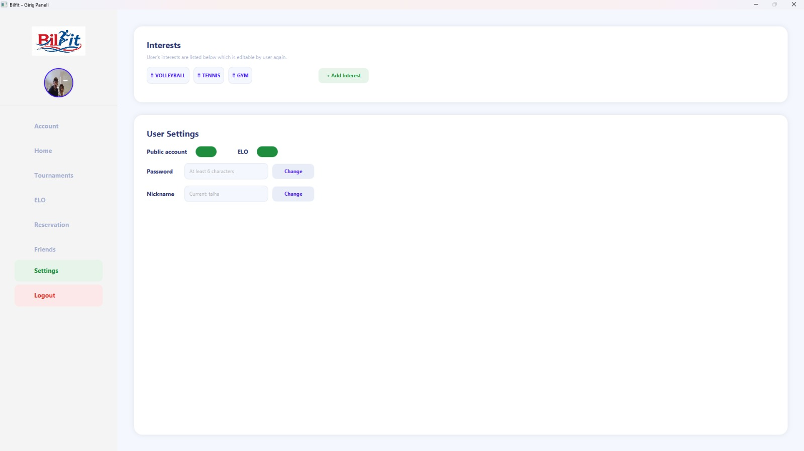

### Admin Management Panel
* **Admin Access:** Secure login and registration screens utilizing a special admin access code.
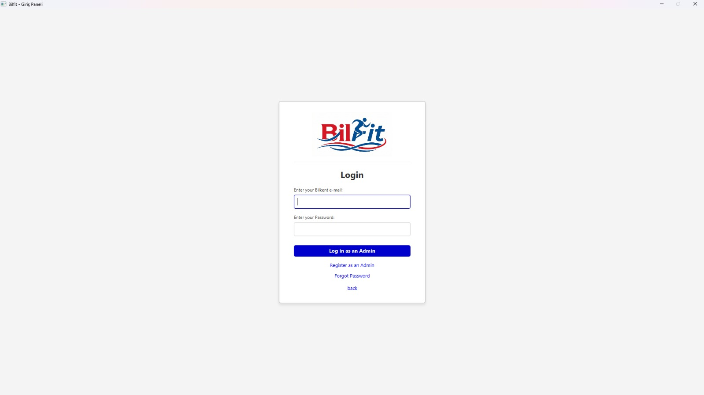
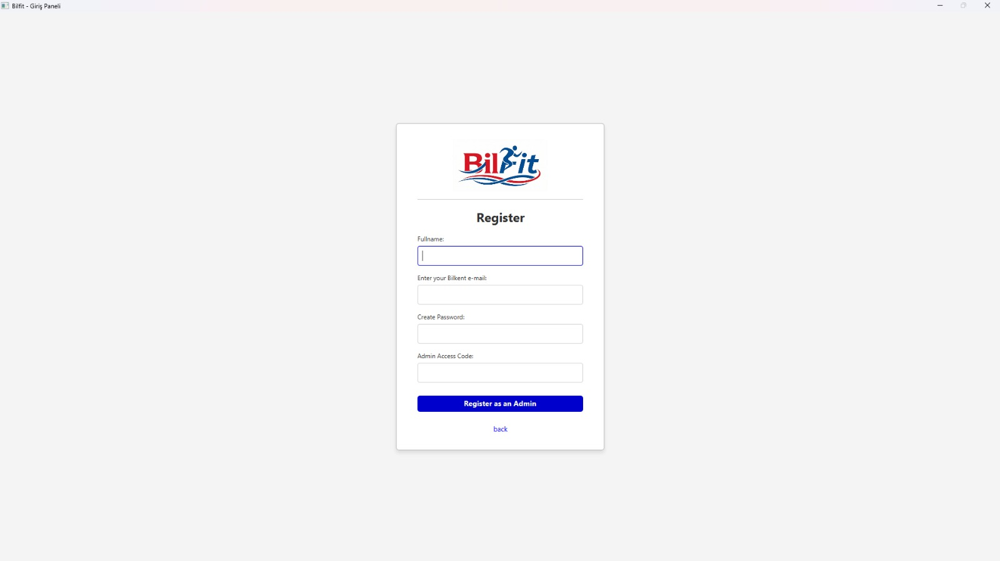
* **Admin Dashboard:** Main dashboard displaying total students, admins, facilities, and system activity logs.
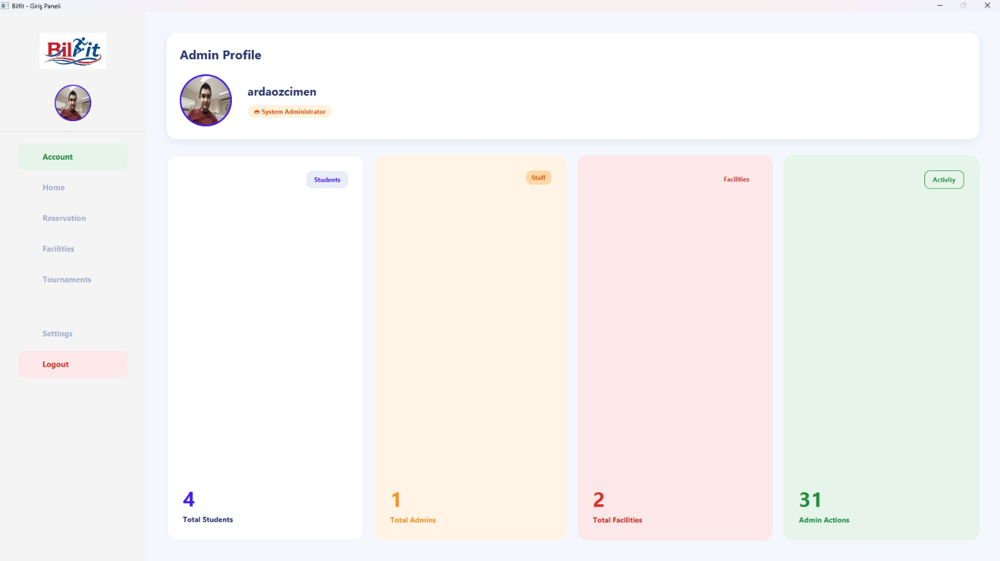
* **Reservation Management:** Center for tracking all bookings, marking attendance, and applying "No-Show" penalties.
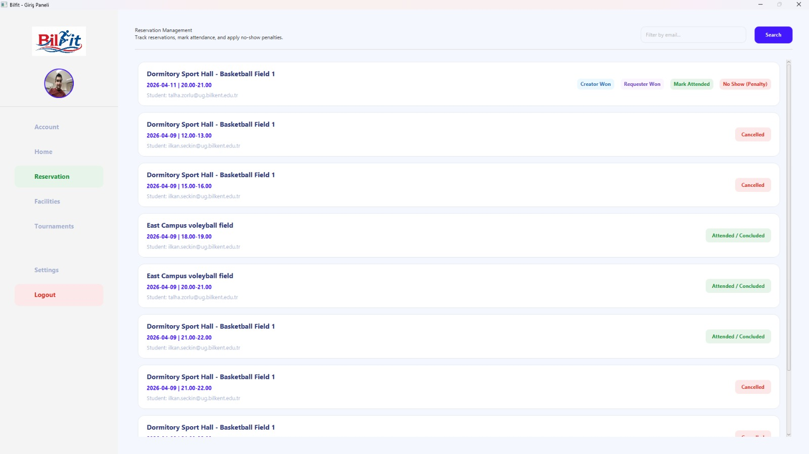
* **Facility Management:** Screen for adding new facilities or putting existing ones under maintenance.
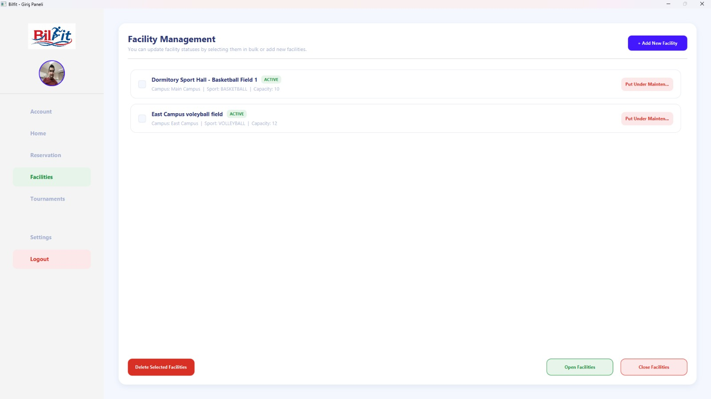
* **Tournament Hub:** Management area for creating new tournaments, drawing fixtures, and entering results.
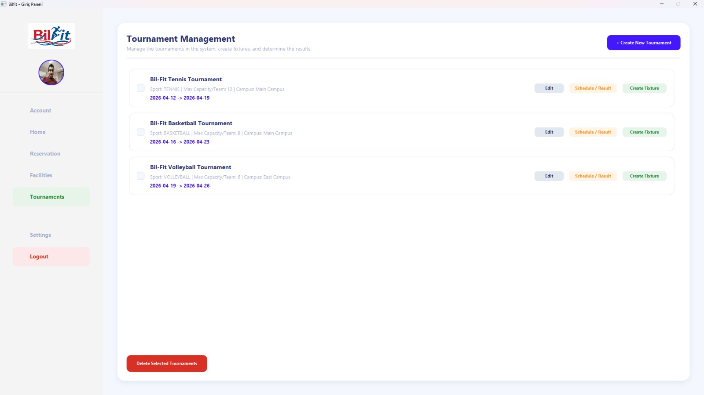
* **User Control Center:** Admin tools for managing penalty points, reliability scores, and banning users from the system.
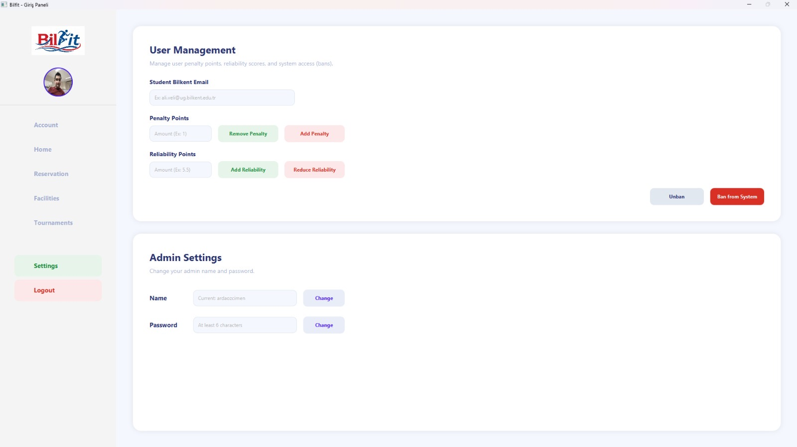

---

## 🛠️ Setup and Configuration

For security reasons, database credentials and API keys are not stored in the source code. You must manually create a configuration file before running the application.

### 1. Create the Properties File
Create a file named **`db.properties`** in the root directory of the project (at the same level as the `src` folder).

### 2. File Content
Copy the following template into your `db.properties` file and replace the placeholders with your actual credentials:

```properties
# Database Connection Settings
db.url=jdbc:postgresql://localhost:5432/your_database_name
db.user=your_username
db.password=your_password

# Security (Hashing Salt)
security.salt=your_unique_salt_string

# Email Service (For Activation Codes)
mail.sender.email=your_email@example.com
mail.sender.password=your_app_specific_password

# Supabase (For Profile Picture Storage)
supabase.url=https://your_project.supabase.co
supabase.key=your_supabase_api_key
```

## 💻 Technical Architecture

- **Backend:** Java *(utilizing Singleton Pattern for database connectivity)*
- **Frontend:** JavaFX *(following the MVC architecture)*
- **Database:** PostgreSQL *(relational database management)*
- **Cloud Storage:** Supabase *(for secure user avatar file hosting)*
- **Security:** SHA-256 Hashing *(with dynamic salting for passwords)*
- **Mailing:** Jakarta Mail API *(with HTML-templated activation emails)*

## 👥 Our Team: Mesmerineers

The dedicated developers behind the BilFit project:

| Member | Role |
| :--- | :--- |
| **Samet Talha Zorlu** | Model & Controllers |
| **Onur Arda Özçimen** | Managers & Organization |
| **Berkin İlkan Seçkin** | Database & Model & Email Services |
| **Berke Özkan** | View & Controllers |
| **Göktan Arslan** | View & CSS |

## 📸 Development Process

Snapshots of our collaborative work sessions:
- 🧠 One of our brainstorming sessions at the library focusing on data models and backend logic.
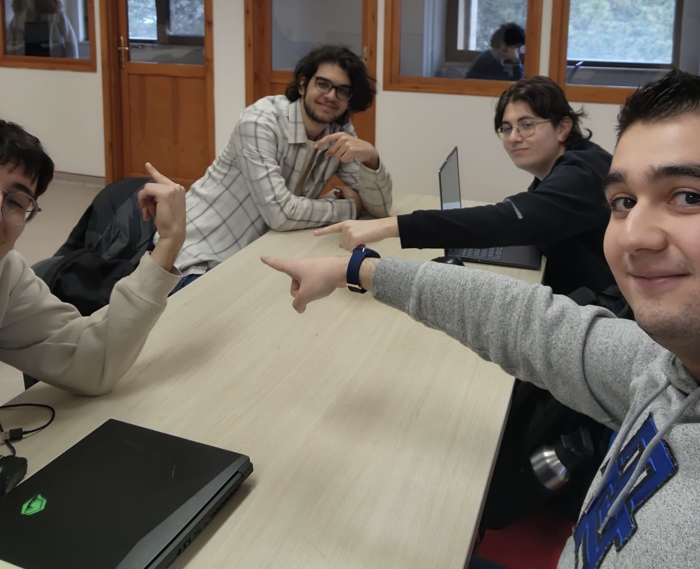

- 🌙 Late-night coding sprints and peer-to-peer code review sessions during the final implementation phase.
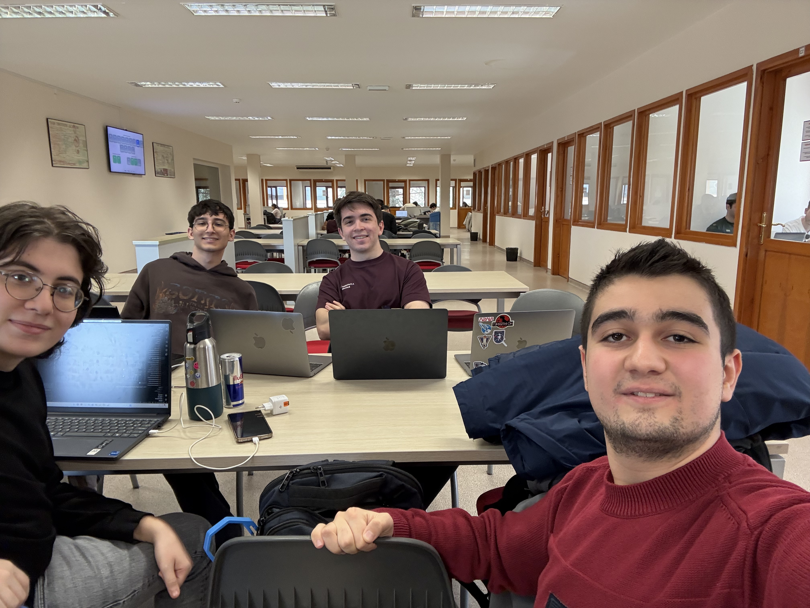

- Bonus

